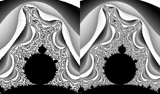

# Mandelbrot set rendering optimization

## Overview

This project features simple Mandelbrot set viewer along with several optimizations introduced in order to increase framerate

### Dependecies

In order to build this code, you need to install [SFML Library](https://www.sfml-dev.org/) as well as [SLEEF Vectorized Math Library](https://sleef.org/) (in case you want to turn on SIMD optimization).

### Building

In order to build project, clone the repository and run  

```bash
make
```

Then run `bin/mandelbrot` file.

You might want to configure you build using `config.h` file

### Controls

+ `WASD` or `Arrow keys` for movement
+ `Space` &ndash; toggle supersampling
+ `Enter` &ndash; take screenshot
+ `I` and `O` for zooming in and out respectively
+ `B` for running benchmark. Resulting FPS will be printed in console

## Mandelbrot set rendering algorithm

### Basics

Mandelbrot set is a set of complex numbers such that function $f_c(z) = z^2 + c$ does not diverge when iterated from $z=0$, i. e. for number $c \in \mathbb{C}$ sequence $f_c(0), f_c(f_c(0)), ...$ is bounded within finite-sized circle. Since it is impossible to check convergence/divergence for any arbitrary point, in practice we can check whether point leaves circle of fixed finite radius after finite number of iterations. It is known that Mandelbrot set is contained within closed circle of radius $2$, so we can assume that every point outside this circle diverges. If we would color points in Mandelbrot black on complex plane and color the rest of the points white, we can create a pretty picture like this:


### Coloring

However, different points outside of the Mandelbrot set diverge with different speed, thus we can assign color based on point's escape time, as well as location after the escape. For this project I've implemented color function that produces result like this:


### Smoothing

If I would just check a point within each pixel, the result might not be pleasant to the eyes, especially in areas we colors change dramatically **really fast**:


In order to overcome this problem, a technique called supersampling might be used. Instead of selecting one point per pixel, several points could be tested (I've decided to use four), and pixel color is considered to be average value of this pixels. It worsens performance yet yields better-looking picture (Picture from previous section uses supersampling), here is a close-up comparisons of the same section of images without/with smoothing:



## Optimization

It is easy to spot that check for each point within Mandelbrot set is performed independently of checks for other points. In theory, if we had processor with as much cores as there are points on the image, we could check each point on its dedicated core. Such algorithms that could easily be separated into multiple parallel tasks are called ***embarrassingly parallel***. We could use two features implemented in modern processors in order to exploit such trait.

### Vector Optimization

First way of optimizing is to take advantage of SIMD Vector extensions implemented in modern CPUs (AVX2 and FMA3 in this case). They allow to perform parallel operations on small vectors (256-bit vectors in case of AVX2). Using this technique, it is possible to restructure the algorithm in a way that allows to test four points concurrently.

In order to restructure the algorithm, let's first have a look at non-vectorized version:

```C++
uint32_t getPointColor(const double Re, const double Im) {
    double curRe = 0,
           curIm = 0,
           newRe = 0,
           newIm = 0;  // Initialize starting values

    unsigned int iter = 0;  // Iteration couter

    for (iter = 0; iter < MAX_ITER; iter++) {  // Convergence check loop
        newIm = curRe * curIm * 2 + Im;
        newRe = curRe * curRe - curIm * curIm + Re;  // Calculate new point positions

        curRe = newRe;
        curIm = newIm;

        if (curRe * curRe + curIm * curIm > DIVERGENCE_RADIUS * DIVERGENCE_RADIUS) {
            break;  // If sequence diverges, exit loop
        }
    }

    return colorize(iter, curRe, curIm);  // Calculate point color and return
}
```

This function takes point position as an input, tests the point and returns the color produced by the coloring function.

### Multithreading

Another feature available in most modern x86-64 CPUs is presents of several cores that allows for concurrent work of several programs. In order to use this feature we could split image in several segments:

Since Mandelbrot set rendering algorithm is embarrassingly parallel, threads do not really need to be synchronized, thus making algorithm parallel is pretty straightforward:

### Optimization results
